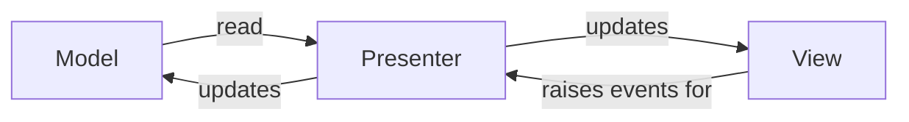
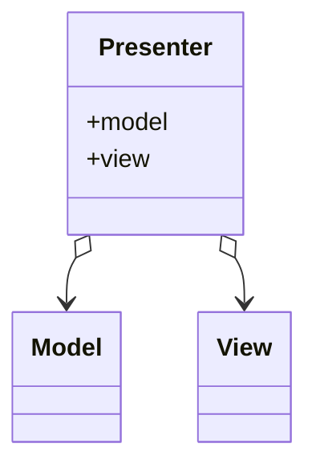

#architecture-pattern

Model doesn't know anything about the view or presenter

The presenter listens to events raised by the view updates and reads from the model and updates the view accordingly

The view raises events for the presenter

**Presenter** is a component that only exists in the MVP model. Presenter gets the input from the view component and processes the data with the help of the model.