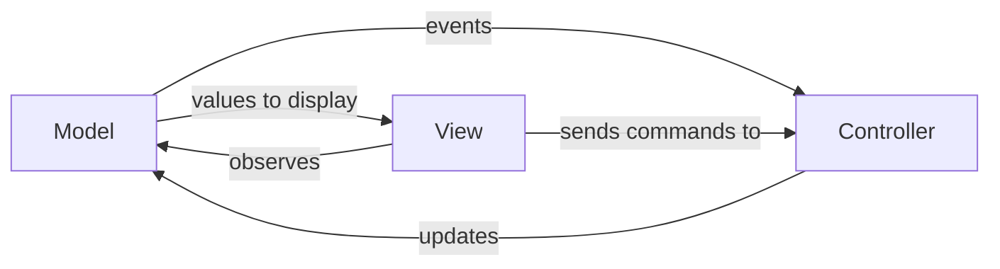
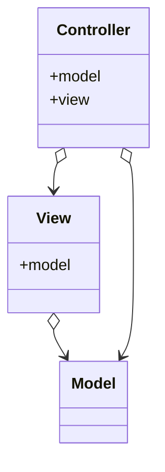

#front-end-architecture-pattern

Model has no references but provides events for the view and controller to observe

The controller subscribes to events from the view and updates the model in response to user actions

The view raises events for the controller to act upon and subscribes to events from the model

The View

**Model** - stores data and communicates directly with the database. Model is the part that represents your data and application logic. It defines the business rules that manage data handling, modification, or processing

**View** displays the model's data and is responsible for the data’s representation in the user interface

**Controller** is the component that integrates the view and model.