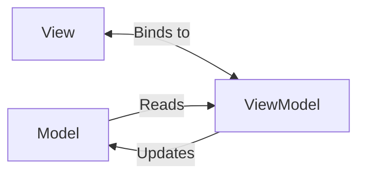
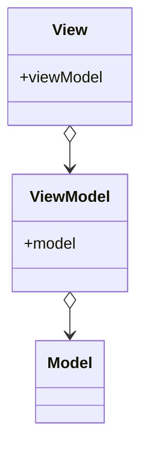

#front-end-architecture-pattern
https://learn.microsoft.com/en-us/dotnet/architecture/maui/mvvm

The View holds reference to the ViewModel and binds to the viewmodel.

The ViewModel holds reference to the Model but doesn't know about the View

The Model doesn't know about either

**ViewModel** is exclusive to MVVM pattern. This is an abstraction of the view layer and also acts as a wrapper for the model data

The MVVM pattern consists of three parts:
1. Model is a representation of the domain data. The model may also be specific to request or API end point. The model knows nothing of the ViewModel or View.
2. ViewModel holds representation of the data for the view and provides an interface of observable data values for the view to bind to. All properties exposed to the view must be bindable meaning on change the binded property send an event so the view knows when to update. ModelView also provides observable commands for the View to bind to which also must be observable in the case the command is enabled or disabled. Commands defined in the view model may instantiate model instances to pass view state to service endpoints. I would also think view model is where validation should be executed and any services should be injected into. ViewModels will know about models as well as other ViewModels. It however should not have any knowledge of a view. In practice it seems like there is a one-to-one relationship between ViewModels and Views however I don't believe this is a requirement. For instance if there are 2 separate views depending on the same data and service calls the 2 views could bind to the same ViewModel. Because of this ViewModels should be transitory instead of singletons.
3. View is the UI to display to the user. The view binds to properties of a ViewModel. In OMNI redline it appears like there will be a dedicated ViewModel per frame. Perhaps composition can be used to modularly build pages using multiple views similar to React components. Hmmm with the way the navigation is implemented I'm not sure if this is true since it is navigation by type

I don't think views are synonymous with pages. It seems more like a React component so a page may consist of several views. Views appear to be reusable however perhaps this isn't done?
The programmer may decide to expose model to the view however the model must then be observable to execute data binding between the view and the underlying data,.